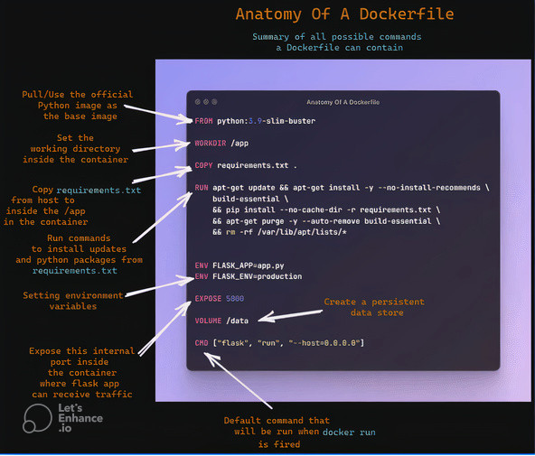
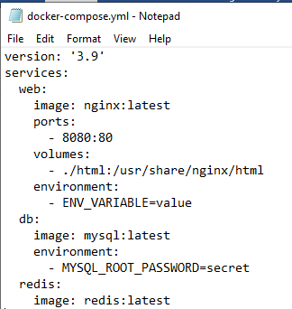

- [Problemes that docker comes to solve](problemes.md)

# DOCKER
# Definition
it is platform designed to simplify the process of developing shipping and ruuning apps using the containerization. think of it is like a bundle that contains all dependencies that your apps need to run.

- [Common Terms](#common-terms)
- [Prepare the Makefile](#preparing-the-makefile)
- [Common commands](#common-commands)

# common terms
- [docker-image](#docker-image)
- [container](#docker-container)
- [Dockerfile](#dockerfile)
- [Dangling image](#dangling-image)
- [container engine](#container-engine)
- [application](#application)
- [Docker compose](#Docker-compose)

# containerization vs virtualization
both are technologies for running isolated applications.

## Virtualization
creates complete virtual machine that include a full operating system. a hypervisor((the software that allows one machine to run multiple VMs by  manages the Hardware resources of the physical machine like (CPU, GPU, Network, RAM, SSD HHD, MONITOR... ))) sits between the hoste OS and VMs. and providing the isolated environment to run your new virtual machine.

VMs are completely isolated from each other and the host
there are another type of HyperVisor that can installed directley on the sever without Host OS. called the HyperVisor-Type1

Each VM contains the whole OS

## Containerization
contianers shares the same host system's kernel. making them faster and more resource-efficient.
examples of the platforms that can run the containers is the DOCKER.

containers must be packaged to work with the same OS of the server.

## Docker image
docker image it is like a blueprint or recipe that contains all necessary information to creat a docker container.
- images can inherit from multiple base images 
- images does't have a state and never change
- a dockerfile must contain one image
- docker-compose can contains multiple images

to creat a docker image we use the dockerfile
## Dockerfile
docker file is a file responsible for configuration, it specifies the set of software that we want to deplow inside a given container.

dockerfile example

FORM: for the base image that contains a set of files and directories and then build on top of it.
 if you want an empty base image that you can manage it with your standars you can use the keywork `scratch`. the layering starts at zero. you  must provide anything.

WORKDIR: set the working directory for the subsequent (RUN, COPY, ...) if the directory does't exist. think of it like cd in shell commands.

COPY ADD : copy and add files and directories to your image

RUN : execute OS commands.

ENV : set specific environment variables : set environment variables inside a container. environment variables is key=value pairs.  

EXPOSE: container starting on giving port

USER : specifies the user that can run that application

CMD, ENTRYPOINT : the command that should be executed by def when we start our container

## Dangling image
when you rebuild an existing image with the same tag. the older image lose its tag. if no tag point to the old image. it will appear in your lits.
these images consume the memory. 
to clean them you can run the command `docker image prune`.

## Docker container
a container is an application that 's been packeged with all its dependencies.
 it is running instance of an images.

- is a runtime instance of an image
- image + execution environment + runtime instructions
- docker containers define a standard to ship software

## Container engine
the container engine is what unpacks the container files and hands them off to the OS kernel. 

## Application
is the actual software or service designed to perform tasks.

## Docker-compose
is a tool for defining and runnig multi-container docker applications. with compose you can use YAML (Stands for Yet Another Markup Language, it is data serialization language) fle to configure your applicaion's services
service == container.

### Syntax

version : wich syntash should be used.  can written in the format "x.x".
services: you can group here a set of services that you want to run.
each service can have
`
	services:
		image: name of the service
		port
`

the containter is a set or processes that have a grouping of resources specifically assigned to it

docker : to see the available commands
docker pull : pull the docker image from the Docker Hub
docker build : creats a docker image from the Dockerfile

# Preparing The Makefile 
inside our Makefile we can define multiple targets.

build:
down:
clean:
fclean:
re:

# Common commands
- [Docker commands](#docker-commands)
- [docker file commands](#common-command-for-dockerfile)
- [docker compose commands](#docker-compose-commands)

## Docker commands
- `docke` : print the neccessary command on the docker
- `docker pull `  downloads an image from a docker registry to you local machin
- `docker build`  builds a new docker image from a dockerfile
	- -t : stands for (tag). to give your image a name and a tag
- `docker images ` lists all docker images stord on your local machine
- `docker image prune`: remove the dangling images and the images that are not associated with any container.
- `docker rmi <ImageName:ItsTag> or <ImageId>` : to remove specific image. you cannot remove image if there is running container based on it. you must stop it first `docker stop <ImageName:ItsTag> or <ImageId>`
- `docker ps` : list the running containers
	-	-a : list all containers not just the running ones.
- `docker run [OPTIONS] IMAGE [COMMAND] [ARGS...]` to run a image

## Docker compose commands
- `docker-compose up` start a container
	- -d (detachec)
	- --build (rebuild images)
- `docker-compose down` stop and remove a container
- `docker-compose pause` : pause running containers of a service
- `docker-compose unpause` : unpause paused containers of a service
- `docker-compose ps` : lists containers
	- -v (remove volumes)
	- --rmi all (remove all images)
- `docker compose up -d` : launching a container in docker-compose
- `docker compose build` : rebuild images without starting 

## Common command for dockerfile

## Common commands for Docker-compose
