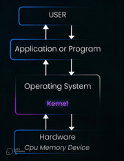

# Definition

is the core of the OS, it is the first and the last thing that is work when your computer run and shut down.

in another word it is the central program in any OS, managing the system resources and enabling the communication between the hardware and software sittig right between your software and your hardware.

